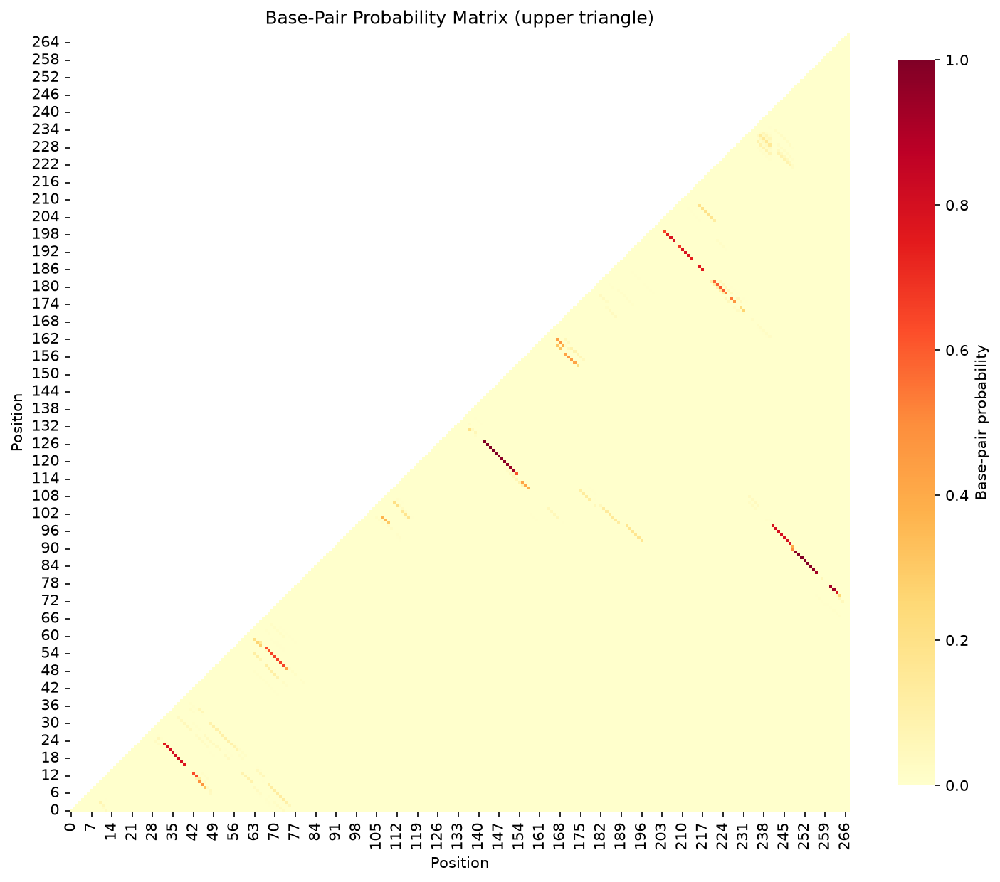

# FoldTrust Structure Reliability Report

## Sequence Information

- **Sequence:** CFTR 5' UTR (cystic fibrosis)
- **Length:** 268 nt
- **GC Content:** 31.7%
- **MFE:** -55.10 kcal/mol
- **Disease:** Cystic Fibrosis
- **Gene:** CFTR (Cystic Fibrosis Transmembrane Conductance Regulator)

## Verdict

**REDESIGN - Contains floppy stems with low ensemble support**

### Teaching Point

Lung disease relevance. UTR structure predictions can bias translation/splicing hypotheses
and inform mRNA optimization strategies for therapeutic delivery.


## Stem Reliability Summary

- **Firm stems:** 3 (mean P ≥ 0.85)
- **Soft stems:** 9 (0.5 ≤ mean P < 0.85)
- **Floppy stems:** 5 (mean P < 0.5)

## Stem Analysis

| Stem ID | Positions | Length (bp) | Mean P(pair) | Flag |
|---------|-----------|-------------|--------------|------|
| 1 | 9-47 ... 11-45 | 3 | 0.422 | **FLOPPY** |
| 2 | 13-44 ... 14-43 | 2 | 0.631 | **SOFT** |
| 3 | 17-40 ... 24-33 | 8 | 0.791 | **SOFT** |
| 4 | 50-75 ... 57-68 | 8 | 0.617 | **SOFT** |
| 5 | 76-264 ... 78-262 | 3 | 0.885 | **FIRM** |
| 6 | 83-257 ... 91-249 | 9 | 0.927 | **FIRM** |
| 7 | 93-248 ... 99-242 | 7 | 0.793 | **SOFT** |
| 8 | 100-110 ... 102-108 | 3 | 0.345 | **FLOPPY** |
| 9 | 112-158 ... 114-156 | 3 | 0.412 | **FLOPPY** |
| 10 | 117-154 ... 128-143 | 12 | 0.951 | **FIRM** |
| 11 | 161-170 ... 163-168 | 3 | 0.432 | **FLOPPY** |
| 12 | 173-232 ... 174-231 | 2 | 0.245 | **FLOPPY** |
| 13 | 176-229 ... 177-228 | 2 | 0.502 | **SOFT** |
| 14 | 179-226 ... 183-222 | 5 | 0.580 | **SOFT** |
| 15 | 187-218 ... 188-217 | 2 | 0.761 | **SOFT** |
| 16 | 191-214 ... 195-210 | 5 | 0.754 | **SOFT** |
| 17 | 197-208 ... 200-205 | 4 | 0.739 | **SOFT** |


**Legend:**
- **FIRM** (mean P ≥ 0.85): High confidence — stem is well-supported by ensemble
- **SOFT** (0.5 ≤ mean P < 0.85): Moderate confidence — alternative structures possible
- **FLOPPY** (mean P < 0.5): Low confidence — MFE stem not reliable in ensemble

## Base-Pair Probability Matrix



*Upper triangle shows probability of base-pairing between positions i and j*

## MFE Structure

```
     1 GAAGGAAATACTCAAAGAATATTTATTTTTAAAAATGTTTAATGGTGATAGAAATGGAATGAGATTGCTG
       ........(((.((..((((((((........))))))))..)))))..((((((((..........)))

    71 TTTCTTGTGATATTTTCTGTAAGGGGATCTACTTTGTGTGAACCAGGGAAATGGAAGCTTTGTGATTCTG
       )))))(((....(((((((((.((((((((((.....))).(((..((((((((((((............

   141 TTGCTTCTGTTTCTGGGTAGTGTAAAAGCAGCCTATCATTCTTGAGGTAATGATTCCAGAAAATTTTGTA
       ..)))))))))))).)))..(((....)))..((.((.(((((...((..(((((.((((....)))).)

   211 ATTAAGACAAAAGGAGAGAGAGAATATTTTTGATTTTCTACAGAAAAGAAAACAGATT
       ))))..))...))))).)).)).........))))))))))))))))....)))....

```

## Methods

**Key principle:** Ask for base-pair probabilities (or the full ensemble), not only the minimum free energy structure.

FoldTrust uses ViennaRNA's partition function to compute the Boltzmann ensemble of all possible secondary structures and their base-pairing probabilities. The MFE structure is parsed into stems, and each stem's reliability is assessed by averaging the pair probabilities of its constituent base pairs.

**Limitations:** Thermodynamic models operate under simplified assumptions (37°C in 1M NaCl). In-cell conditions, co-transcriptional folding, RNA-binding proteins, and post-transcriptional modifications can alter structure. Experimental probing (SHAPE, DMS) and functional assays remain essential for validation.


## References

- [The Cystic Fibrosis Transmembrane Conductance Regulator](https://doi.org/10.1152/physrev.00025.2017)
- [Molecular basis of cystic fibrosis](https://doi.org/10.1056/NEJM199209033271007)


---

*Generated by FoldTrust v0.1.0 — By Kishore Anekalla*

*Energy model: ViennaRNA default parameters (Turner 2004)*
