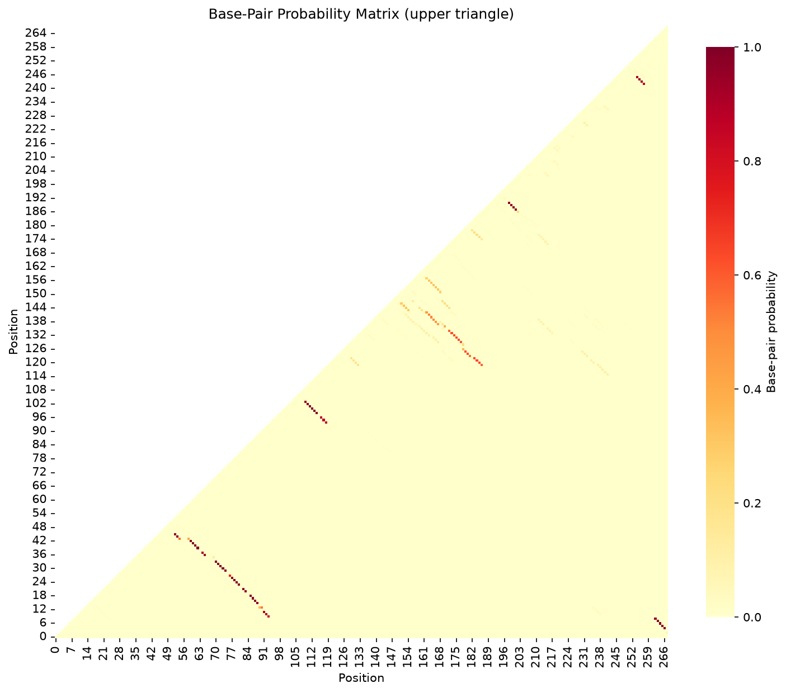

# FoldTrust Structure Reliability Report

## Sequence Information

- **Sequence:** HCV IRES Domain II (hepatitis C virus internal ribosome entry site)
- **Length:** 268 nt
- **GC Content:** 57.5%
- **MFE:** -91.20 kcal/mol
- **Disease:** Hepatitis C
- **Gene:** HCV (Hepatitis C Virus) 5' UTR IRES

## Verdict

**REDESIGN - Contains floppy stems with low ensemble support**

### Teaching Point

Structured viral RNA. Ensemble softness near functional loops can indicate flexibility
required for ribosome binding, informing structure-based antiviral design.


## Stem Reliability Summary

- **Firm stems:** 12 (mean P ≥ 0.85)
- **Soft stems:** 4 (0.5 ≤ mean P < 0.85)
- **Floppy stems:** 2 (mean P < 0.5)

## Stem Analysis

| Stem ID | Positions | Length (bp) | Mean P(pair) | Flag |
|---------|-----------|-------------|--------------|------|
| 1 | 5-267 ... 9-263 | 5 | 0.982 | **FIRM** |
| 2 | 10-94 ... 12-92 | 3 | 0.881 | **FIRM** |
| 3 | 16-89 ... 19-86 | 4 | 0.980 | **FIRM** |
| 4 | 21-84 ... 22-83 | 2 | 0.981 | **FIRM** |
| 5 | 24-81 ... 28-77 | 5 | 0.936 | **FIRM** |
| 6 | 30-75 ... 34-71 | 5 | 0.998 | **FIRM** |
| 7 | 37-66 ... 38-65 | 2 | 0.925 | **FIRM** |
| 8 | 40-63 ... 43-60 | 4 | 0.992 | **FIRM** |
| 9 | 44-55 ... 46-53 | 3 | 0.837 | **SOFT** |
| 10 | 95-119 ... 97-117 | 3 | 0.871 | **FIRM** |
| 11 | 99-115 ... 104-110 | 6 | 0.987 | **FIRM** |
| 12 | 120-187 ... 123-184 | 4 | 0.622 | **SOFT** |
| 13 | 124-182 ... 127-179 | 4 | 0.541 | **SOFT** |
| 14 | 130-178 ... 135-173 | 6 | 0.616 | **SOFT** |
| 15 | 138-168 ... 143-163 | 6 | 0.480 | **FLOPPY** |
| 16 | 144-155 ... 147-152 | 4 | 0.309 | **FLOPPY** |
| 17 | 188-202 ... 191-199 | 4 | 0.969 | **FIRM** |
| 18 | 243-258 ... 246-255 | 4 | 0.918 | **FIRM** |


**Legend:**
- **FIRM** (mean P ≥ 0.85): High confidence — stem is well-supported by ensemble
- **SOFT** (0.5 ≤ mean P < 0.85): Moderate confidence — alternative structures possible
- **FLOPPY** (mean P < 0.5): Low confidence — MFE stem not reliable in ensemble

## Base-Pair Probability Matrix



*Upper triangle shows probability of base-pairing between positions i and j*

## MFE Structure

```
     1 CTGCGGAACCGGTGAGTACACCGGAATTGCCAGGACGACCGGGTCCTTTCTTGGATAAACCCGCTCAATG
       ....((((((((.(.((((.((.(((((.(((((..((.(((((((......)))....)))).))....

    71 CCTGGAGATTTGGGCGTGCCCCCGCAAGACTGCTAGCCGAGTAGTGTTGGGTCGCGAAAGGCCTTGTGGT
       ))))).))))).)).)))).))))(((.((((((.....)))))).)))((((((((..((((((.((((

   141 ACTGCCTGATAGGGTGCTTGCGAGTGCCCCGGGAGGTCTCGTAGACCGTGCACCATGAGCACGAATCCTA
       (((((((....)))).......))))))..).)))))))))).))))((((.......))))........

   211 AACCTCAAAGAAAAACCAAACGTAACACCAACCGTCGCCCACAGGACGTCAAGTTCCC
       ................................((((........))))....))))).

```

## Methods

**Key principle:** Ask for base-pair probabilities (or the full ensemble), not only the minimum free energy structure.

FoldTrust uses ViennaRNA's partition function to compute the Boltzmann ensemble of all possible secondary structures and their base-pairing probabilities. The MFE structure is parsed into stems, and each stem's reliability is assessed by averaging the pair probabilities of its constituent base pairs.

**Limitations:** Thermodynamic models operate under simplified assumptions (37°C in 1M NaCl). In-cell conditions, co-transcriptional folding, RNA-binding proteins, and post-transcriptional modifications can alter structure. Experimental probing (SHAPE, DMS) and functional assays remain essential for validation.


## References

- [Structure of the hepatitis C virus IRES](https://doi.org/10.1006/jmbi.1999.2918)
- [The hepatitis C virus internal ribosome entry site](https://doi.org/10.1016/S0168-1702(98)00058-7)


---

*Generated by FoldTrust v0.1.0 — By Kishore Anekalla*

*Energy model: ViennaRNA default parameters (Turner 2004)*
