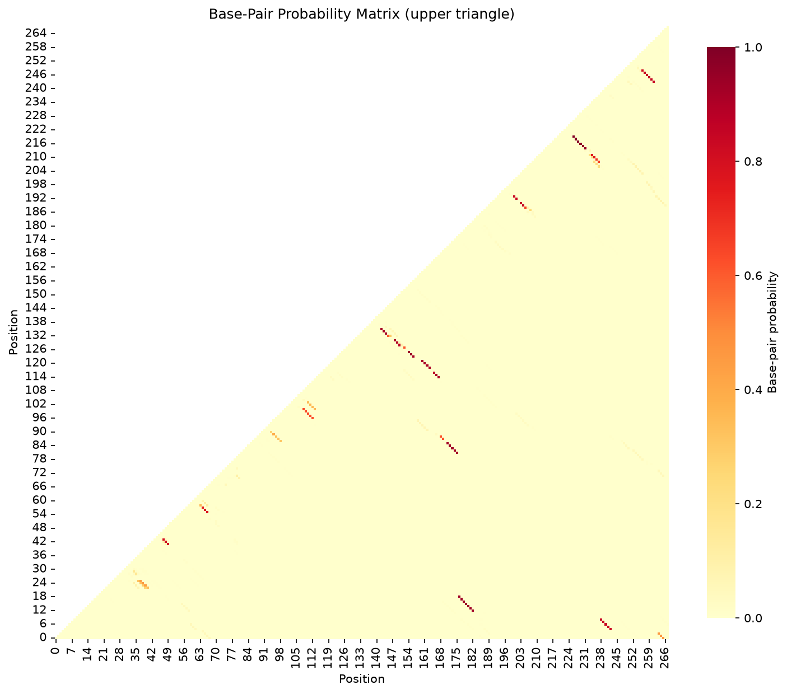

# FoldTrust Structure Reliability Report

## Sequence Information

- **Sequence:** MAPT exon 10 splice regulatory region (tau, neurodegeneration)
- **Length:** 268 nt
- **GC Content:** 58.6%
- **MFE:** -86.00 kcal/mol
- **Disease:** Frontotemporal dementia, Progressive supranuclear palsy, Alzheimer's disease
- **Gene:** MAPT (Microtubule-Associated Protein Tau)

## Verdict

**REDESIGN - Contains floppy stems with low ensemble support**

### Teaching Point

Disease splicing regulation via structure. Ensemble softness near the splice site affects
structure-aware oligonucleotide design for splice switching therapies.


## Stem Reliability Summary

- **Firm stems:** 7 (mean P ≥ 0.85)
- **Soft stems:** 10 (0.5 ≤ mean P < 0.85)
- **Floppy stems:** 2 (mean P < 0.5)

## Stem Analysis

| Stem ID | Positions | Length (bp) | Mean P(pair) | Flag |
|---------|-----------|-------------|--------------|------|
| 1 | 1-266 ... 3-264 | 3 | 0.456 | **FLOPPY** |
| 2 | 5-243 ... 9-239 | 5 | 0.835 | **SOFT** |
| 3 | 13-183 ... 19-177 | 7 | 0.933 | **FIRM** |
| 4 | 23-40 ... 26-37 | 4 | 0.305 | **FLOPPY** |
| 5 | 42-50 ... 44-48 | 3 | 0.811 | **SOFT** |
| 6 | 56-67 ... 58-65 | 3 | 0.765 | **SOFT** |
| 7 | 82-176 ... 86-172 | 5 | 0.927 | **FIRM** |
| 8 | 88-170 ... 89-169 | 2 | 0.614 | **SOFT** |
| 9 | 97-113 ... 101-109 | 5 | 0.628 | **SOFT** |
| 10 | 115-168 ... 117-166 | 3 | 0.896 | **FIRM** |
| 11 | 119-164 ... 122-161 | 4 | 0.912 | **FIRM** |
| 12 | 124-157 ... 126-155 | 3 | 0.936 | **FIRM** |
| 13 | 129-151 ... 131-149 | 3 | 0.894 | **FIRM** |
| 14 | 133-146 ... 136-143 | 4 | 0.838 | **SOFT** |
| 15 | 189-206 ... 191-204 | 3 | 0.785 | **SOFT** |
| 16 | 193-202 ... 194-201 | 2 | 0.836 | **SOFT** |
| 17 | 209-238 ... 212-235 | 4 | 0.716 | **SOFT** |
| 18 | 215-232 ... 220-227 | 6 | 0.973 | **FIRM** |
| 19 | 244-262 ... 249-257 | 6 | 0.838 | **SOFT** |


**Legend:**
- **FIRM** (mean P ≥ 0.85): High confidence — stem is well-supported by ensemble
- **SOFT** (0.5 ≤ mean P < 0.85): Moderate confidence — alternative structures possible
- **FLOPPY** (mean P < 0.5): Low confidence — MFE stem not reliable in ensemble

## Base-Pair Probability Matrix



*Upper triangle shows probability of base-pairing between positions i and j*

## MFE Structure

```
     1 GGCACTGAGAACCTGCAGGATATTCTGATTTAATGAAGGAAGGGGAACCCAAGAAGCAGCAGATTGCCAA
       (((.(((((...(((((((...((((..........)))).(((...))).....(((......)))...

    71 TGACGAAACCAGCCTGGGCCAACCTGGTCACGTCCACAGTGACGGCTCCACCAAGCACGGCAGCGGCTCT
       ...........(((((.((.......(((((.......))))).(((.((((.(((.((((.((((....

   141 AACCGTCCGCCTGAGCTACAGGTGCAGCGTGCAGGCCCTGCAGAACCGTGGACTGCAACAAGACCAGCGT
       ..))))..))).).)))...)))).))))).)))))))))))).....(((.((......)).)))..((

   211 GGAGAAGGCCAAGACAGGCTTTGCCCGCCTCAGCACATCAGCGCTGGATGTGAGTCTC
       ((..((((((......))))))..)))))))))((((((.......)))))).)))..

```

## Methods

**Key principle:** Ask for base-pair probabilities (or the full ensemble), not only the minimum free energy structure.

FoldTrust uses ViennaRNA's partition function to compute the Boltzmann ensemble of all possible secondary structures and their base-pairing probabilities. The MFE structure is parsed into stems, and each stem's reliability is assessed by averaging the pair probabilities of its constituent base pairs.

**Limitations:** Thermodynamic models operate under simplified assumptions (37°C in 1M NaCl). In-cell conditions, co-transcriptional folding, RNA-binding proteins, and post-transcriptional modifications can alter structure. Experimental probing (SHAPE, DMS) and functional assays remain essential for validation.


## References

- [An extended stem-loop structure in the MAPT gene controls exon 10 splicing](https://doi.org/10.1093/hmg/10.10.1029)
- [Tau alternative splicing and frontotemporal dementia](https://doi.org/10.1016/j.nbd.2005.07.017)


---

*Generated by FoldTrust v0.1.0 — Personal portfolio project by Kishore Anekalla*

*Energy model: ViennaRNA default parameters (Turner 2004)*
