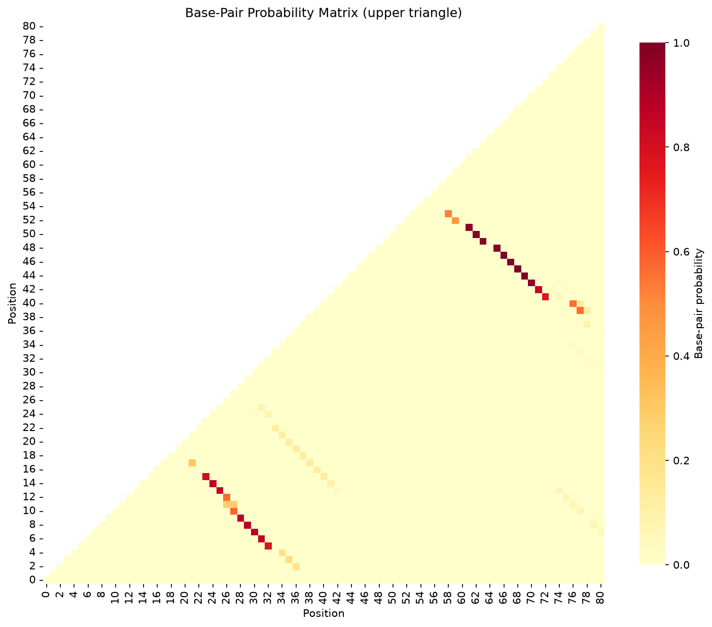

# FoldTrust Structure Reliability Report

## Sequence Information

- **Sequence:** SARS-CoV-2 frameshift stimulatory element (nsp12 region)
- **Length:** 181 nt
- **GC Content:** 32.0%
- **MFE:** -39.50 kcal/mol
- **Disease:** COVID-19
- **Gene:** SARS-CoV-2 ORF1ab (nsp12 frameshift site)

## Verdict

**REDESIGN - Contains floppy stems with low ensemble support**

### Teaching Point

Competing structures and pseudoknot formation mean the MFE alone is insufficient.
This region demonstrates ensemble complexity relevant to antiviral RNA targeting.


## Stem Reliability Summary

- **Firm stems:** 1 (mean P ≥ 0.85)
- **Soft stems:** 0 (0.5 ≤ mean P < 0.85)
- **Floppy stems:** 7 (mean P < 0.5)

## Stem Analysis

| Stem ID | Positions | Length (bp) | Mean P(pair) | Flag |
|---------|-----------|-------------|--------------|------|
| 1 | 15-176 ... 22-169 | 8 | 0.101 | **FLOPPY** |
| 2 | 24-167 ... 28-163 | 5 | 0.101 | **FLOPPY** |
| 3 | 38-64 ... 43-59 | 6 | 0.108 | **FLOPPY** |
| 4 | 46-56 ... 48-54 | 3 | 0.138 | **FLOPPY** |
| 5 | 65-93 ... 72-86 | 8 | 0.174 | **FLOPPY** |
| 6 | 94-110 ... 100-104 | 7 | 0.921 | **FIRM** |
| 7 | 111-156 ... 121-146 | 11 | 0.177 | **FLOPPY** |
| 8 | 128-139 ... 131-136 | 4 | 0.164 | **FLOPPY** |


**Legend:**
- **FIRM** (mean P ≥ 0.85): High confidence — stem is well-supported by ensemble
- **SOFT** (0.5 ≤ mean P < 0.85): Moderate confidence — alternative structures possible
- **FLOPPY** (mean P < 0.5): Low confidence — MFE stem not reliable in ensemble

## Base-Pair Probability Matrix



*Upper triangle shows probability of base-pairing between positions i and j*

## MFE Structure

```
     1 TTTAAATGGTTATATAGGTTTTTTGTTACATTGTTAAGTCTGTGATGCCATGCGCAGGATAGATCCATTA
       ..............((((((((.(((((.........((((((..(((.....)))..))))))((((((

    71 GTGCAAAGAATAAAAGCTGGTGGGCTTCTATTTTAGAGGCTTATTAAAACTTGGTAATACTTTTGGGTAC
       ((.............))))))))(((((((...)))))))(((((((((((......((((....)))).

   141 TTTTTGGTTTTGGTAACTTTATTAATACAAGGCTTAACTTT
       .....)))))))))))......))))).)))))))).....

```

## Methods

**Key principle:** Ask for base-pair probabilities (or the full ensemble), not only the minimum free energy structure.

FoldTrust uses ViennaRNA's partition function to compute the Boltzmann ensemble of all possible secondary structures and their base-pairing probabilities. The MFE structure is parsed into stems, and each stem's reliability is assessed by averaging the pair probabilities of its constituent base pairs.

**Limitations:** Thermodynamic models operate under simplified assumptions (37°C in 1M NaCl). In-cell conditions, co-transcriptional folding, RNA-binding proteins, and post-transcriptional modifications can alter structure. Experimental probing (SHAPE, DMS) and functional assays remain essential for validation.


## References

- [Programmed -1 Ribosomal Frameshift in SARS-CoV-2](https://doi.org/10.1126/science.abc3546)
- [Structure of the SARS-CoV-2 frameshifting pseudoknot](https://doi.org/10.1093/nar/gkaa1369)


---

*Generated by FoldTrust v0.1.0 — By Kishore Anekalla*

*Energy model: ViennaRNA default parameters (Turner 2004)*
