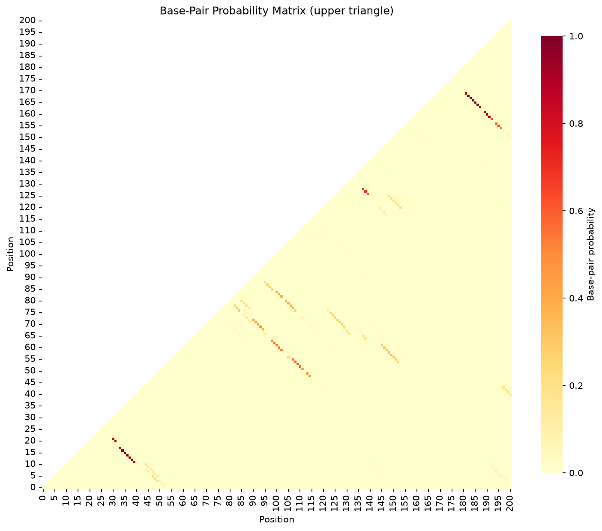

# FoldTrust Structure Reliability Report

## Sequence Information

- **Sequence:** SMN2 intron 7 ISS-N1 region (Spinraza target neighborhood)
- **Length:** 201 nt
- **GC Content:** 22.9%
- **MFE:** -29.40 kcal/mol
- **Disease:** Spinal Muscular Atrophy (SMA)
- **Gene:** SMN2 (Survival Motor Neuron 2)

## Verdict

**REDESIGN - Contains floppy stems with low ensemble support**

### Teaching Point

ASO site selection requires assessing local pairing probability, not just MFE cartoons.
Stems that look firm in the MFE but are floppy in the ensemble may be better ASO targets.


## Stem Reliability Summary

- **Firm stems:** 3 (mean P ≥ 0.85)
- **Soft stems:** 5 (0.5 ≤ mean P < 0.85)
- **Floppy stems:** 5 (mean P < 0.5)

## Stem Analysis

| Stem ID | Positions | Length (bp) | Mean P(pair) | Flag |
|---------|-----------|-------------|--------------|------|
| 1 | 12-40 ... 18-34 | 7 | 0.962 | **FIRM** |
| 2 | 21-32 ... 22-31 | 2 | 0.874 | **FIRM** |
| 3 | 41-201 ... 44-198 | 4 | 0.189 | **FLOPPY** |
| 4 | 49-115 ... 50-114 | 2 | 0.458 | **FLOPPY** |
| 5 | 52-112 ... 56-108 | 5 | 0.544 | **SOFT** |
| 6 | 60-103 ... 64-99 | 5 | 0.530 | **SOFT** |
| 7 | 69-95 ... 73-91 | 5 | 0.441 | **FLOPPY** |
| 8 | 78-89 ... 81-86 | 4 | 0.171 | **FLOPPY** |
| 9 | 121-154 ... 126-149 | 6 | 0.217 | **FLOPPY** |
| 10 | 127-140 ... 129-138 | 3 | 0.647 | **SOFT** |
| 11 | 155-197 ... 157-195 | 3 | 0.603 | **SOFT** |
| 12 | 159-193 ... 162-190 | 4 | 0.809 | **SOFT** |
| 13 | 164-188 ... 170-182 | 7 | 0.966 | **FIRM** |


**Legend:**
- **FIRM** (mean P ≥ 0.85): High confidence — stem is well-supported by ensemble
- **SOFT** (0.5 ≤ mean P < 0.85): Moderate confidence — alternative structures possible
- **FLOPPY** (mean P < 0.5): Low confidence — MFE stem not reliable in ensemble

## Base-Pair Probability Matrix



*Upper triangle shows probability of base-pairing between positions i and j*

## MFE Structure

```
     1 CTTACATAAAAGCCATAATTTCTTTTATTTGATTTATGGTGTCATTTTGTTAACTGTATTTATACCTGAA
       ...........(((((((..((........)).)))))))((((....((.(((((...(((((....((

    71 GGAATATGATCTTCAGATTCTCCTTAATTATGATGATCAGTTTACTCTTAATATATTCCTCATTTTTGGA
       (((....((((....)))).)))))...)))))....))))).)).....(((((((((........)))

   141 CTTTTTAAATATATATATAATATATAAGGATTTTTTTTTTCTCCTTGTCTATTTTATTGAT
       ........))))))(((.((((.(((((((...........))))))).)))).)))))))

```

## Methods

**Key principle:** Ask for base-pair probabilities (or the full ensemble), not only the minimum free energy structure.

FoldTrust uses ViennaRNA's partition function to compute the Boltzmann ensemble of all possible secondary structures and their base-pairing probabilities. The MFE structure is parsed into stems, and each stem's reliability is assessed by averaging the pair probabilities of its constituent base pairs.

**Limitations:** Thermodynamic models operate under simplified assumptions (37°C in 1M NaCl). In-cell conditions, co-transcriptional folding, RNA-binding proteins, and post-transcriptional modifications can alter structure. Experimental probing (SHAPE, DMS) and functional assays remain essential for validation.


## References

- [Nusinersen versus Sham Control in Infantile-Onset Spinal Muscular Atrophy](https://doi.org/10.1056/NEJMoa1702752)
- [An intronic splicing silencer causes skipping of the IVS7 donor site in SMN2](https://doi.org/10.1093/hmg/11.15.1833)


---

*Generated by FoldTrust v0.1.0 — By Kishore Anekalla*

*Energy model: ViennaRNA default parameters (Turner 2004)*
